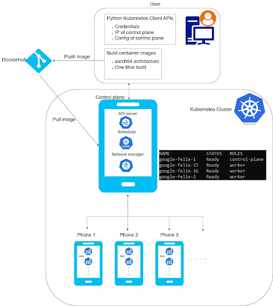

# Junkyard-CSE237D

The rapid growth of the smartphone market and the associated frequent upgrades contribute significantly to the escalating problem of electronic waste. A substantial number of discarded phones remain functional and contain powerful CPUs and GPUs. There is hence a strong motivation to reuse these phones. The long term goal of the Junkyard project is to build a general purpose data centre from reused phones. As a step towards this goal, we propose to develop distributed processing and networking capabilities for the phone cluster and support two applications - Automated grading and distributed processing of FishSense computer vision workloads. This repository is home to the automated grading project “Green Grader” and it aims to run automated grading jobs of courses at UCSD on the reused phone cluster and thus offset the costs of running them on cloud services and other machines.

The cluster consists of sixteen Google Pixel Fold phones connected to a workstation called Automaton through ethernet. It is therefore a wired Local Area Network. The workstation will manage and schedule jobs across the phones as depicted in Figure 1. A user would send job requests to the workstation. The nature of the user can vary according to the application. For example, in the Green Grader project, the user would be gradescope.

The MVP design consists of three main parts: (a) a phone cluster with a master node (control plane) and workers, (b) external users, and (c) a container image repository. The control plane manages the cluster via components like the API server, network manager, and scheduler. External users interact with the cluster using Kubernetes Python APIs, providing a kubeconfig file and control plane IP. Jobs are defined in YAML scripts, specifying container images and commands. These containers, built and stored in repositories like DockerHub, are pulled by the control plane when jobs run. Frequently used images are cached to reduce download overhead.

The demo video for our MVP is linked here: https://drive.google.com/file/d/1OZ91TmYszhsiNwLxHcVTKsSIAbj3IPGc/view?usp=sharing

---
